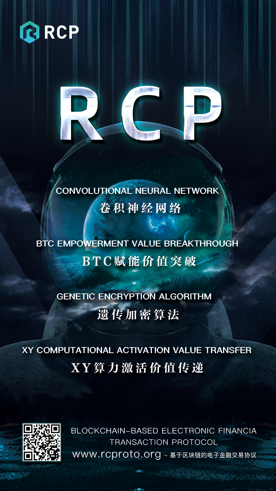
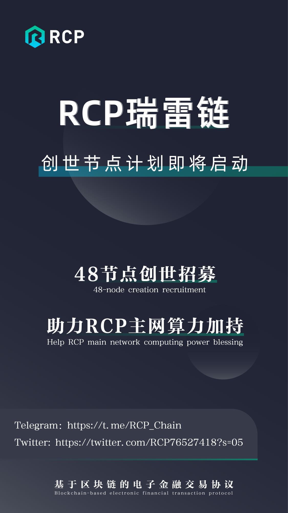
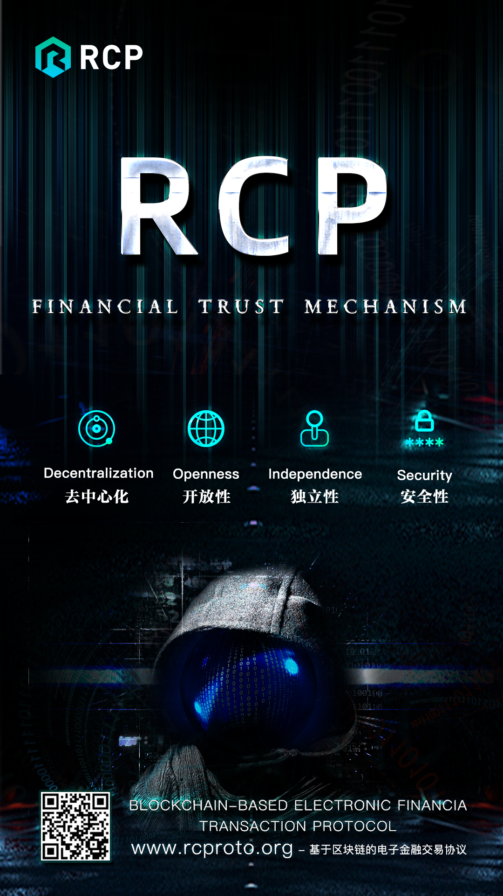
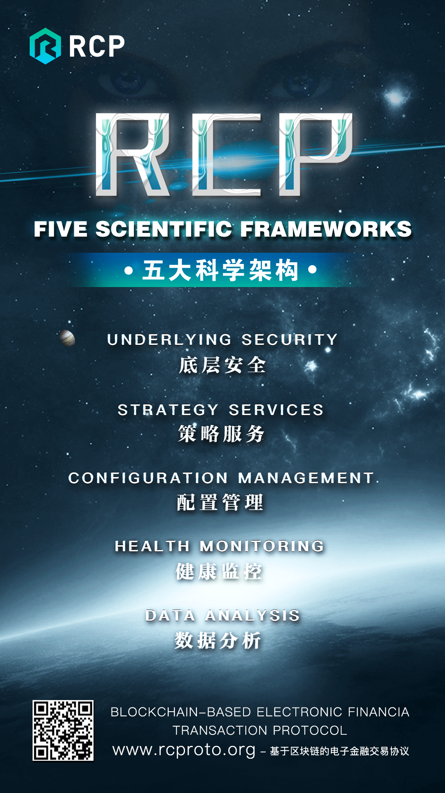
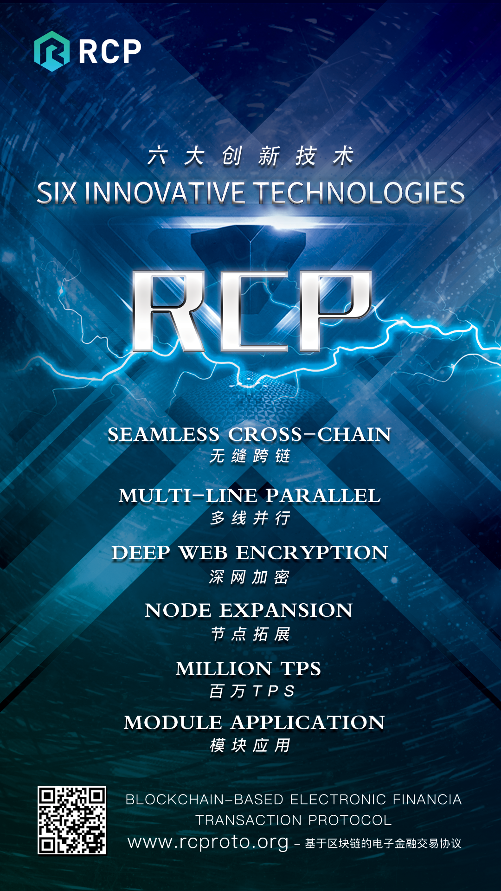
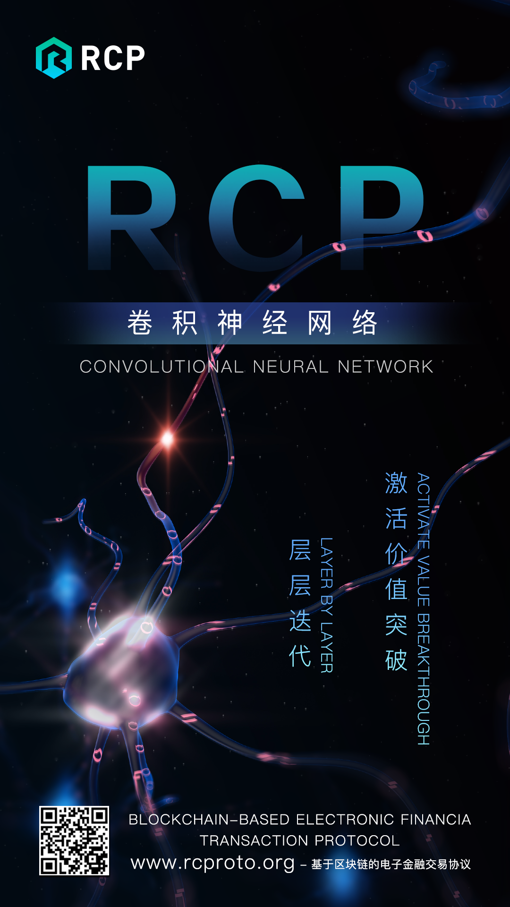
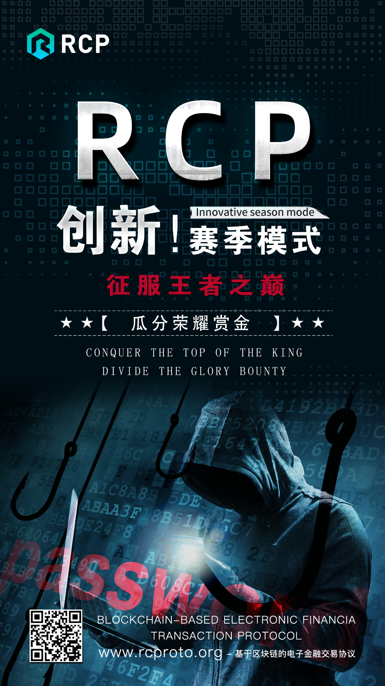

# RCP瑞雷链 掌握核心科技，才能掌控未来带你了解 卷积神经网络，BTC赋能价值突破，遗传学加密算法，XY算力激活价值传递

# RCP瑞雷链 Are you ready？你准备好了么？RCP--创世节点计划即将启动，48节点创世招募！助力RCP主网算力等你来加持

# RCP瑞雷链 【RCP瑞雷链的金融信任机制】 1.去中心化 2.开放性 3.独立性 4.安全性

## 从传统到未来 RCP用技术打造不一样的公链

### 区块链技术突破激活金融革命

### RCP多功能公链生态平台，为世界金融行业提供全方位服务

### 区块链技术迎来重大突破，全新共识机制RCP即将公布

### RCP News
|文章标题|宣传时间|国外/国内|宣传网站|宣传优势|网站地址|
|:--|:--|:--|:--|:--|:--|
|从传统到未来 RCP用技术打造不一样的公链|20191119|国内|博客||http://blog.sina.com.cn/s/blog_18e58b6480102z7g6.html|
||||币乎||https://bihu.com/preview|
||||金色财经||https://www.jinse.com/blockchain/527740.html|
||||一点资讯||https://www.yidianzixun.com/article/0NpJati9|
||||简书 ||https://www.jianshu.com/p/832e567ca62c|
||||知乎||https://zhuanlan.zhihu.com/p/92591758|
||||云顶区块链||https://www.yidianzixun.com/article/0NpJaM1W|
||||凤凰网||https://feng.ifeng.com/c/7riz3N5CL9g|
|||国外|Digital Journal|数字期刊在世界200多个国家拥有成千上万的成员及内容提供者每月访客量达数百万|[http://digitaljournal.com/pr/4510961](http://digitaljournal.com/pr/4510961)|
||||Dailyherald|美国先驱日报被IPA评为“2015最好的新闻网站”|http://finance.dailyherald.com/dailyherald/news/read/39153673/|
||||Post-gazette|邮政公报|http://markets.post-gazette.com/postgazette/news/read/39153673|
||||Buffalonews|布法罗新闻报（水牛城新闻报） 股神巴菲特控股，全美利润最高的报纸，该报每天的发行量高达三十万份|http://markets.buffalonews.com/buffnews/news/read/39153673/|
||||Financialcontent|美国著名金融媒体 华尔街信息来源渠道之一|http://markets.financialcontent.com/stocks/news/read/39153673|
||||Am-news|美国晨报100年以上历史的著名媒体|http://business.am-news.com/am-news/markets/news/read/39153673|
||||The Post & Mail|美国本地综合资讯门户网站|http://business.thepostandmail.com/thepostandmail/markets/news/read/39153673/|
||||theeveningleader|美国先锋晚报|http://business.theeveningleader.com/theeveningleader/markets/news/read/39153673/|
||||Newsok|大俄克拉荷马城最大的日报|http://stocks.newsok.com/newsok/news/read/39153673|
||||Azcentral|亚利桑那州人|http://finance.azcentral.com/azcentral/news/read/39153673/|
||||Marketplace|市场报|http://thenumbers.marketplace.org/publicradio/news/read/39153673|
||||Bigspringherald|大春田先驱报|http://business.bigspringherald.com/bigspringherald/markets/news/read/39153673/|
||||Observernewsonline|观察者新闻在线|http://business.observernewsonline.com/observernewsonline/markets/news/read/39153673/|
||||Times Online|时代在线|http://business.times-online.com/times-online/markets/news/read/39153673/|
||||DailyTimesLeader|每日时代领导者|http://business.dailytimesleader.com/dailytimesleader/markets/news/read/39153673/|
||||Ask.com|全球知名搜索引擎咨询网|http://markets.ask.com/ask/news/read/39153673|
||||FOX|美国著名电视媒体|http://www.fox34.com/story/41340310/news|
||||ABC|全美著名商业广播电视公司|http://www.abc6.com/story/41340310/news|
||||news9|全美著名商业广播电视公司|http://www.news9.com/story/41340310/news​|
||||NewsOn6|美国电视媒体|http://www.newson6.com/story/41340310/news​|
||||WRCB TV|美国电视媒体|http://www.wrcbtv.com/story/41340310/news​|
||||KTVN|美国电视媒体|http://www.ktvn.com/story/41340310/news​|
||||WBOC|美国电视媒体|http://www.wboc.com/story/41340310/news|
||||KAKE|美国电视媒体|http://www.kake.com/story/41340310/news​|
||||WFMJ|美国电视媒体|http://www.wfmj.com/story/41340310/news​|
||||WENY|美国电视媒体|http://www.weny.com/story/41340310/news​|
|区块链技术突破激活金融革命|20191121|国内|博客||[http://blog.sina.com.cn/s/blog_18e58b6480102z7gp.html](http://blog.sina.com.cn/s/blog_18e58b6480102z7gp.html)|
||||点石财经||http://author.frienews.com/detail/content/80001.html|
||||币乎||https://bihu.com/article/1189039492|
||||金色财经||[https://www.jinse.com/blockchain/530502.html](https://www.jinse.com/blockchain/530502.html)|
||||壹资讯||https://feng.ifeng.com/c/7rmYkwIBju6|
||||UC新闻||https://mparticle.uc.cn/article.html?uc_param_str=frdnsnpfvecpntnwprdssskt&wm_aid=6ed512481394411481594becbc0bb1a5|
||||一点资讯||https://www.yidianzixun.com/article/0NqaxYbn|
||||简书||https://www.jianshu.com/p/7f7968b479bf|
||||知乎||https://zhuanlan.zhihu.com/p/92968269|
||||云顶区块链||https://www.yidianzixun.com/article/0NqayRSv|
||||凤凰网||https://feng.ifeng.com/c/7rmOP0Q6tYF|
|RCP多功能公链生态平台，为世界金融行业提供全方位服务|20191121|国内|博客||http://blog.sina.com.cn/s/blog_18e58b6480102z7h1.html|
||||币乎||https://bihu.com/article/1630988819|
||||点石财经||https://feng.ifeng.com/c/7ro16QVmgUT|
||||UC新闻||https://mparticle.uc.cn/article.html?uc_param_str=frdnsnpfvecpntnwprdssskt&wm_aid=2ac6104c88ee47ab896fd7f34aec5810|
||||一点资讯||https://www.yidianzixun.com/article/0NrlLrKo|
||||简书||https://www.jianshu.com/p/48fc12953e8c|
||||知乎||https://zhuanlan.zhihu.com/p/93172918|
||||云顶区块链||https://www.yidianzixun.com/article/0NrlLwkR|
|RCP创世节点计划崛起，超音速节点技术的重要性逐渐凸显|20191122|国内|博客||[http://blog.sina.com.cn/s/blog_18e58b6480102z7ij.html](http://blog.sina.com.cn/s/blog_18e58b6480102z7ij.html)|
||||点石财经|||
||||币乎||https://bihu.com/article/1715738245|
||||金色财经||https://www.jinse.com/blockchain/534646.html|
||||壹资讯|||
||||UC新闻||https://mparticle.uc.cn/article.html?uc_param_str=frdnsnpfvecpntnwprdssskt&wm_aid=cefb1ad430354a4aad9fdf2d0c577add|
||||一点资讯||https://www.yidianzixun.com/article/0NtopKmi|
||||简书||https://www.jianshu.com/p/c6cfce4bc811|
||||知乎||https://zhuanlan.zhihu.com/p/93715693|
||||云顶区块链||https://www.yidianzixun.com/article/0NtooVDO|
||||凤凰网||http://wemedia.ifeng.com/6604910145463918820/wemedia.shtml|
|RCP云端的供应链金融系统 让供应链金融更安全、快速、便捷|20191124|国内|博客||http://blog.sina.com.cn/s/blog_18e58b6480102z7ix.html|
||||币乎||https://bihu.com/article/1738674127|
||||金色财经||https://www.jinse.com/blockchain/536721.html|
||||壹资讯||http://wemedia.ifeng.com/6605713012978364418/wemedia.shtml|
||||一点资讯||https://www.yidianzixun.com/article/0NvOAsgh|
||||简书||https://www.jianshu.com/p/0ef92c3c606b|
||||知乎||https://zhuanlan.zhihu.com/p/94137750|
||||云顶区块链||https://www.yidianzixun.com/article/0NvOArny|
||||凤凰网||https://feng.ifeng.com/c/7ry9jvpr3fG|
|区块链技术迎来重大突破，全新共识机制RCP即将公布|20191202|国内|点石财经||http://author.frienews.com/detail/content/82659.html|
||||币乎||https://bihu.com/article/1931572389|
||||金色财经||https://www.jinse.com/blockchain/539193.html|
||||壹资讯||https://feng.ifeng.com/c/7s4ohW0pv05|
||||一点资讯||https://www.yidianzixun.com/article/0NxtT2h6|
||||简书||https://www.jianshu.com/p/217915f32456|
||||知乎||https://zhuanlan.zhihu.com/p/94759480|
||||云顶区块链||https://www.yidianzixun.com/article/0NxtT0ve|
||||凤凰网||https://feng.ifeng.com/c/7s4p8Sez5Lv|
|RCP用区块链技术赋能供应链金融 让中小企业融资不再难|20191204|国内|博客|| http://blog.sina.com.cn/s/blog_18e58b6480102z7k5.html|
||||点石财经||http://author.frienews.com/detail/content/83443.html|
||||币乎||https://bihu.com/article/1693437061|
||||金色财经||https://www.jinse.com/blockchain/540890.html|
||||一点资讯||https://www.yidianzixun.com/article/0NzDivBz|
||||简书||https://www.jianshu.com/p/79d0452cf156|
||||知乎||https://zhuanlan.zhihu.com/p/95220861|
||||云顶区块链||https://www.yidianzixun.com/article/0NzDinNP|
||||火星财经||https://news.huoxing24.com/20191204135945484631.html|
|RCP genesis node plan rises, node technology becomes more important|20191203|国外|Dailyherald||http://finance.dailyherald.com/dailyherald/news/read/39215712/|
||||Post-gazette||http://markets.post-gazette.com/postgazette/news/read/39215712|
||||Financial||http://markets.financialcontent.com/stocks/news/read/39215712|
||||Buffalonews||http://markets.buffalonews.com/buffnews/news/read/39215712/|
||||MorningNews||http://business.am-news.com/am-news/markets/news/read/39215712|
||||Post & Mail||http://business.thepostandmail.com/thepostandmail/markets/news/read/39215712/|
||||Leader||http://business.theeveningleader.com/theeveningleader/markets/news/read/39215712/|
||||NewsOK||http://stocks.newsok.com/newsok/news/read/39215712|
||||Azcentral||http://finance.azcentral.com/azcentral/news/read/39215712/|
||||Marketplace||http://thenumbers.marketplace.org/publicradio/news/read/39215712|

